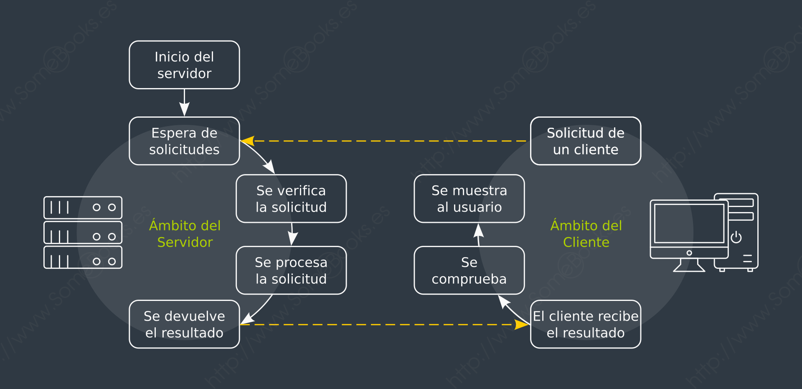

## Introducción a los Sistemas Operativos en Red

---
### ¿Qué es un Sistema Operativo en Red?

---
* Un sistema operativo diseñado para gestionar recursos y servicios en una red.

* Permite que múltiples usuarios accedan a archivos, impresoras y otros recursos de forma compartida.

* Facilita la comunicación entre diferentes dispositivos en la red.

---
### Componentes clave

---
* El servidor:
    * ordenador, normalmente con prestaciones **elevadas**, que ejecuta servicios
* El cliente:
    * ordenador, normalmente con prestaciones **ajustadas**, que requiere los servicios de un equipo servidor
* El Middleware:
    * Es la parte del software del sistema que se encarga del **transporte** de los mensajes entre el cliente y el servidor

---
### El funcionamiento básico

---

---
### Arquitectura por niveles

---
1. Un nivel de presentación, que aglutina los elementos relativos al cliente
2. Un nivel de aplicación, compuesto por elementos relacionados con el servidor
3. Un nivel de comunicación, que está formado por los elementos que hacen posible la comunicación entre el cliente y el servidor
4. Un nivel de base de datos, formado por los elementos relacionados con el acceso a los datos

---
### Concepto de Sistema Operativo de Red

---
> Un Sistema Operativo de Red es una especialización del concepto genérico de sistema operativo que se centra en ofrecer un comportamiento de “**sistema único**” a una implementación cliente/servidor.

---
### Directrices a cumplir

---

    

        <ul>
            <li>Autenticación</li>
            <li>Confidencialidad</li>
            <li>Espacio de nombres</li>
            <li>Ubicación</li>
            <li>Administración</li>
        </ul>
    

    

        <ul>
            <li>Protocolos</li>
            <li>Acceso a los recursos</li>
            <li>Replicación</li>
            <li>Tratamiento de los fallos</li>
            <li>Tiempo</li>
        </ul>
    

---

### Autenticación

La **autenticación**: el mismo nombre de usuario y la misma contraseña deben servir para acceder a recursos en todo el sistema.

---

### Confidencialidad

La **confidencialidad** en la transmisión de los datos: utilizando algún mecanismo de cifrado para el intercambio de información entre el cliente y el servidor.

---

### Espacio de nombres

El **espacio de nombres**: los convenios sobre los nombres de los recursos deben ser independientes de los sistemas operativos que los alojan.

---

### Ubicación

La **ubicación**: cada recurso debe conocerse sólo por su nombre, sin importar el sistema donde se ejecutan.

---

### Administración

La **administración**: se debe facilitar un mismo mecanismo de gestión para todos los recursos.

---

### Protocolos

Los **protocolos**: deben tener una API (Application Programming Interface) idéntica en todos los sistemas.

---

### Acceso a los recursos

El **acceso a los recursos**: como hemos dicho más arriba, debe producirse como si estuviese ubicado en el mismo sistema donde se encuentra el cliente.

---

### Replicación

La **replicación**: se debe conseguir que no existan diferencias entre dos copias del mismo recurso ubicadas en dos sistemas diferentes.

---

### Tratamiento de los fallos

El **tratamiento de los fallos**: se deben ofrecer mecanismos de detección de los fallos, redundancia de los recursos en función de su importancia y reconexión cuando el fallo ha sido solventado.

---

### Tiempo

El **tiempo**: Los relojes de todos los dispositivos de la infraestructura deben estar sincronizados.

---

